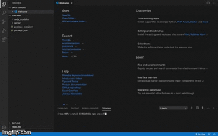

<p align="center">
  
</p>

[](https://github.com/team-reactype/ReacType/pulls)


#

A developer tool to generate a GraphQL API from a known relational database.

#

## What Is TorchQL?

**TorchQL** is an open-source tool to assist developers in the migration from REST APIs to GraphQL.
It facilitates the task of exposing a GraphQL API over a relational database. In other words, **you
can use it to implement GraphQL in your application!** Just visit our website
[here](https://www.torchql.com/).

Our developer tool introspects an existing PostgreSQL or MySQL database and generates and returns
GraphQL schema and resolvers. You can download these schema and resolvers to the desktop or let
TorchQL assemble them in a lightweight zip package in the context of a real GraphQL API. After
running your unzipped application, you can use
<a href="https://github.com/prisma-labs/graphql-playground">GraphQL Playground</a>, a built-in
graphical interactive in-browser GraphQL IDE, to begin querying your database!

<p align="center">

</p>

## How It Works

**TorchQL** uses the metadata extracted from a SQL database to generate GraphQL custom types,
queries, mutations, and resolvers. The schema and resolvers can be returned in either SDL or
programmatic format and are downloadable as a single desktop file. For experienced users,
**TorchQL** permits the custom editing of schemas and resolvers in the browser prior to download.

For a PostgreSQL database, enter your database address in the input box. For a MySQL database, enter
your host, user, password, and database information. Then select either of the following formats for
your GraphQL schema and resolvers:

- As Schema Definition Language or **SDL**
- As GraphQLSchema object or **Programmatic**

After entering your information, a new screen should appear displaying all your schema and resolvers
properly formatted in a text editor.

<strong>SDL Example</strong>&nbsp; &nbsp; &nbsp; &nbsp; &nbsp; &nbsp; &nbsp;
&nbsp; &nbsp; &nbsp; &nbsp; &nbsp; &nbsp; &nbsp; &nbsp; &nbsp; &nbsp; &nbsp; &nbsp; &nbsp; &nbsp;
&nbsp; &nbsp; &nbsp; &nbsp; &nbsp; &nbsp; &nbsp; &nbsp; &nbsp; &nbsp; &nbsp; &nbsp; &nbsp; &nbsp;
&nbsp; &nbsp; &nbsp; &nbsp; &nbsp; &nbsp; &nbsp; <strong>Programmatic Example</strong>

<p align="center">

</p>

Click on the **Save Schema** button to save your formatted schema and resolvers to the desktop.

Click on the **Test Schema** button to save your formatted schema and resolvers as a GraphQL server
file in a folder on the desktop.

## How to Test Your Schema and Resolvers:

- **Unzip** package
- **Open** directory
- **Install** dependencies

```bash
npm install
```

- **Run** application

```bash
npm start
```

Just follow the instructions in the console or enter
localhost:3000/<a href="https://github.com/prisma-labs/graphql-playground">playground</a> in your
browser, and now you can begin querying your database!

<p align="center">

</p>

## Contributing

TorchQL is currently in beta release. We welcome all contributions & pull requests!

## Authors

- **[Eric Tang](https://www.edtang.dev)** - [@edtang44](https://github.com/edtang44)
- **[Jimmy Chen](https://www.linkedin.com/in/jimchn/)** - [@jimchn](https://github.com/jimchn)
- **[Mark Fusco](https://www.linkedin.com/in/marklfusco/)** -
  [@QuestionMark3](https://github.com/QuestionMark3)
- **[Sara Chang](https://www.linkedin.com/in/sara-chang/)** -
  [@sarachang530](https://github.com/sarachang530)
- **[Zac Haluza](https://haluza.dev)** - [@zhaluza](https://github.com/zhaluza)

## License

This project is licensed under the MIT License
